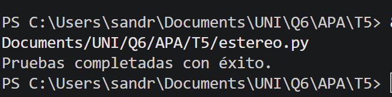
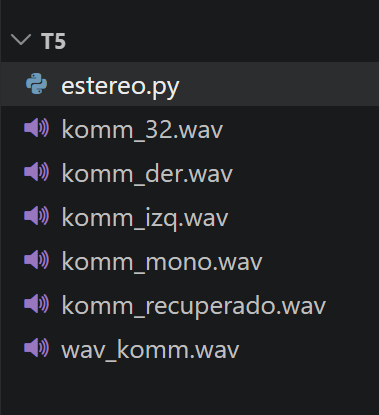
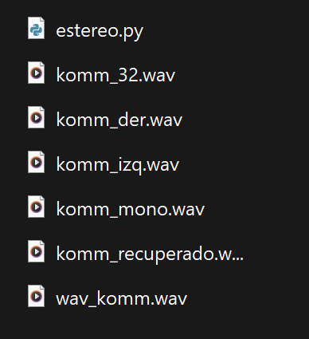

# Quinta tarea de APA 2026: Sonido estéreo y ficheros WAVE

**Nombre:** Sandra Cots Agüera

## Descripción
Este proyecto consiste en una biblioteca de funciones en Python para manipular archivos de audio en formato WAVE utilizando exclusivamente la librería struct. El código permite gestionar canales estéreo, realizar conversiones a mono y emplear técnicas de ocultación de datos en sistemas de 32 bits.

---

### Código Desarrollado


## Funciones auxiliares de cabecera.
Se han implementado funciones para empaquetar y desempaquetar las cabeceras de 44 bytes de los ficheros WAVE, facilitando la validación del formato y la modificación de metadatos (canales, sample rate, etc.).

```python
def empaqueta_cabecera(p):
    """Empaqueta un diccionario de parámetros en una cabecera WAVE de 44 bytes."""
    return struct.pack('<4sI4s4sIHHIIHH4sI',
        p['ChunkID'], p['ChunkSize'], p['Format'], p['Subchunk1ID'],
        p['Subchunk1Size'], p['AudioFormat'], p['NumChannels'], p['SampleRate'],
        p['ByteRate'], p['BlockAlign'], p['BitsPerSample'], p['Subchunk2ID'],
        p['Subchunk2Size'])

def desempaqueta_cabecera(datos):
    """Desempaqueta 44 bytes y devuelve un diccionario con los parámetros WAVE."""
    if len(datos) < 44:
        raise ValueError("Cabecera incompleta.")
    res = struct.unpack('<4sI4s4sIHHIIHH4sI', datos)
    if res[0] != b'RIFF' or res[2] != b'WAVE':
        raise TypeError("Formato de fichero no soportado (debe ser WAVE).")
    return {
        'ChunkID': res[0], 'ChunkSize': res[1], 'Format': res[2],
        'Subchunk1ID': res[3], 'Subchunk1Size': res[4], 'AudioFormat': res[5],
        'NumChannels': res[6], 'SampleRate': res[7], 'ByteRate': res[8],
        'BlockAlign': res[9], 'BitsPerSample': res[10], 'Subchunk2ID': res[11],
        'Subchunk2Size': res[12]
    }
```


### Código de estereo2mono()
Esta función extrae la información de un fichero estéreo. Se ha evitado el uso de bucles mediante comprensiones de listas y slicing de muestras.

```python
def estereo2mono(ficEste, ficMono, canal=2):
    """Convierte estéreo a mono usando comprensiones de listas."""
    with open(ficEste, 'rb') as f_in, open(ficMono, 'wb') as f_out:
        p = desempaqueta_cabecera(f_in.read(44))
        if p['NumChannels'] != 2:
            raise ValueError("El fichero de entrada debe ser estéreo.")

        p.update({
            'NumChannels': 1,
            'ByteRate': p['SampleRate'] * (p['BitsPerSample'] // 8),
            'BlockAlign': p['BitsPerSample'] // 8,
            'Subchunk2Size': p['Subchunk2Size'] // 2,
            'ChunkSize': (p['Subchunk2Size'] // 2) + 36
        })
        f_out.write(empaqueta_cabecera(p))

        muestras = struct.unpack(f'<{p["Subchunk2Size"]//p["BlockAlign"]*2}h', f_in.read())
        izq, der = muestras[::2], muestras[1::2]

        if canal == 0: res = izq
        elif canal == 1: res = der
        elif canal == 2: res = [(l + r) // 2 for l, r in zip(izq, der)]
        else: res = [(l - r) // 2 for l, r in zip(izq, der)]
        
        f_out.write(struct.pack(f'<{len(res)}h', *res))
```


### Código de mono2estereo()   
 Combina dos ficheros monofónicos intercalando sus muestras para crear una señal estéreo.

```python
def mono2estereo(ficIzq, ficDer, ficEste):
    """Combina dos ficheros mono en uno estéreo intercalando muestras."""
    with open(ficIzq, 'rb') as f_izq, open(ficDer, 'rb') as f_der, open(ficEste, 'wb') as f_out:
        p = desempaqueta_cabecera(f_izq.read(44))
        desempaqueta_cabecera(f_der.read(44))
        
        p.update({
            'NumChannels': 2,
            'ByteRate': p['SampleRate'] * 2 * (p['BitsPerSample'] // 8),
            'BlockAlign': 2 * (p['BitsPerSample'] // 8),
            'Subchunk2Size': p['Subchunk2Size'] * 2,
            'ChunkSize': (p['Subchunk2Size'] * 2) + 36
        })
        f_out.write(empaqueta_cabecera(p))

        m_izq = struct.unpack(f'<{p["Subchunk2Size"]//4}h', f_izq.read())
        m_der = struct.unpack(f'<{p["Subchunk2Size"]//4}h', f_der.read())
        
        res = [m for par in zip(m_izq, m_der) for m in par]
        f_out.write(struct.pack(f'<{len(res)}h', *res))
```


### Código de codEstereo()
Codifica la señal estéreo en un contenedor de 32 bits, situando la semisuma en los 16 bits más significativos.

```python
def codEstereo(ficEste, fic32):
    """Codifica estéreo en 32 bits (MSB=Semisuma, LSB=Semidiferencia)."""
    with open(ficEste, 'rb') as f_in, open(fic32, 'wb') as f_out:
        p = desempaqueta_cabecera(f_in.read(44))
        p.update({'NumChannels': 1, 'BitsPerSample': 32, 'ByteRate': p['SampleRate'] * 4, 'BlockAlign': 4})
        f_out.write(empaqueta_cabecera(p))

        m = struct.unpack(f'<{p["Subchunk2Size"]//2}h', f_in.read())
        res = [(((l+r)//2) << 16) | (((l-r)//2) & 0xffff) for l, r in zip(m[::2], m[1::2])]
        f_out.write(struct.pack(f'<{len(res)}i', *res))
```


### Código de decEstereo()
Recupera la señal estéreo original a partir del fichero de 32 bits mediante operaciones de bits.

```python
def decEstereo(fic32, ficEste):
    """Decodifica el fichero de 32 bits para recuperar el estéreo original."""
    with open(fic32, 'rb') as f_in, open(ficEste, 'wb') as f_out:
        p = desempaqueta_cabecera(f_in.read(44))
        p.update({'NumChannels': 2, 'BitsPerSample': 16, 'ByteRate': p['SampleRate'] * 4, 'BlockAlign': 4})
        f_out.write(empaqueta_cabecera(p))

        m32 = struct.unpack(f'<{p["Subchunk2Size"]//4}i', f_in.read())
        datos = [(m >> 16, struct.unpack('<h', struct.pack('<H', m & 0xffff))[0]) for m in m32]
        res = [val for ss, sd in datos for val in (ss + sd, ss - sd)]
        f_out.write(struct.pack(f'<{len(res)}h', *res))

```

## Pruebas del funcionamiento.
Para verificar el correcto funcionamiento del código, se han realizado pruebas con el fichero `wav_komm.wav`. A continuación se muestra la generación de los archivos resultantes y la confirmación de la terminal:

**1. Pruebas completadas con éxito:**


**2. Audios en el programa:**


**3. Audios en mi pc:**

